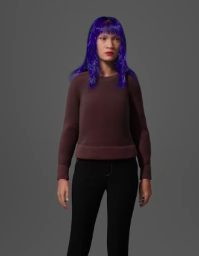

# Atividade Ponderada Semana 2 - Experiências Imersivas
## Descrição do personagem

[Arquivo MetaHuman](metahuman/Pownder.mhb)

Nome: Laura Zaun.
Idade: 24 anos
Ocupação: Grafiteira e artista urbana

Laura tem cabelos médios e azul-violeta, que brilham sob a luz como reflexos de néon. Seu estilo casual é prático, mas carregado de personalidade: ela usa um suéter marrom aconchegante, uma calça preta simples e tênis de corrida, pronta para o dia a dia. 
Laura transformou seu amor por cores e formas em arte. Suas obras de grafite carregam traços que lembram o caos e a liberdade.

## Tecnologias utilizadas
### MetaHuman Creator

O MetaHuman Creator é uma ferramenta para criação de personagens digitais altamente realistas de maneira rápida e intuitiva. Ela é integrada à tecnologia do Unreal Engine, ela combina um pipeline de animação avançado com recursos de modelagem facial e corporal detalhados, sendo muito útil no desenvolvimento de jogos e animações para jogos.

### Elevenlabs

É uma plataforma de inteligência artificial que possibilita a geração de áudio realista por meio de síntese de voz. Utiliza tecnologias avançadas de deep learning, também permite criar vozes naturais que podem ser personaliadas, sendo usada em narrativas, jogos, produção de conteúdo e acessibilidade.

Além de permitir transformar texto em aúdio, também é possível clonar vozes com a ferramenta, e a ferramenta também oferece suporte para múltiplos idiomas.

## Roteiro da interação

A personagem se encontra se encontra sendo entrevistada em frente a um de seus murais na cidade e se apresenta pela primeira vez para a comunidade, o texto a ser falado representa.

[Fala da Laura Zaun](audio/Laura_Zaun.mp3)

Transcrição do áudio: "Meu nome é Laura Zaun. Eu sou artista urbana, ou, como todo mundo fala, grafiteira. Desde pequena eu olhava pros muros e imaginava histórias desenhadas neles. Hoje, é isso que eu faço: deixo minha marca e conto histórias por onde passo. Pra mim, cada canto da cidade é uma chance de mudar o cinza pra algo... vivo.
Ah, e sobre o meu cabelo, sim, ele é azul-violeta. Não, não foi por impulso. É minha forma de lembrar que a gente pode ser uma explosão de cor mesmo num mundo cinzento. Meu objetivo, é que quando você cruzar por um mural por aí, você pense: 'Será que foi a Laura quem fez?'. Se isso acontecer, acho que já estarei feliz."